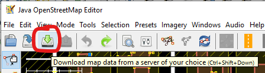
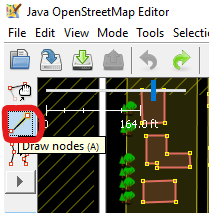
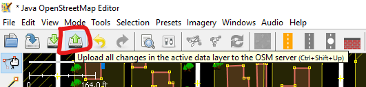

# OSM Data Editing Instructions

These instructions describe the process of editing OSM data for the Calbike BNA
project. There are five main sections:

1. Software needs
2. Downloading OSM
3. Editing OSM
4. Syncing with the main OSM database
5. Working with the planned bike network

## Software Needs

The training will use [JOSM](https://josm.openstreetmap.de/) as the OSM editor.
This is open source software and can be downloaded and used freely for updating
OSM data. The software can be downloaded from the link. JOSM also requires Java.
The installation will automatically search for Java on your system and suggest
an installation if it can't find one.

There are many other OSM editors, including the online iD editor, which are
suitable for making changes to OSM based on existing conditions. However, care
should be taken not to submit edits to OSM based on the _planned_ network, since
these conditions are not relevant to the current OSM dataset.

The actual BNA runs on Python. Instructions specific to running the BNA will be
provided at a future training.

## Downloading OSM

You may download OSM data from various sources. JOSM includes the ability to
download OSM data directly to the editor. This works well for small areas like
the station areas we will be looking at. If a larger area is needed you can
download an .osm from any number of good sources, such as
[bbbike.org](https://extract.bbbike.org/).

To download data for the area you wish to work on, open JOSM and select the
Download Data tool.

Navigate the map to the area you wish to download and draw a rectangle around
it. JOSM will automatically download this data for you. You can download new
data at any point by repeating this process.

While working on existing conditions, it is not necessary to download the entire
area of interest. Instead, we suggest you work in a small area and routinely
download new data from OSM as you move through the area of interest.

Multiple users can be working on the existing conditions as long as each user is
regularly downloading the latest OSM and submitting their edits back to the main
database.

## Editing OSM

#### Basic Editing

OSM is based on a key=value scheme. Each key=value pair is called a tag. When
you edit OSM, your work will be to add or edit tags on the transportation
network to accurately reflect conditions for bicycling.

To edit a tag on an individual feature, you can simply click on the feature to
select it. The interface will show a list of tags. If you're editing an existing
tag, simply click on the tag and enter a new value. If you need to add a tag,
select the `+` symbol to bring up the new tag dialog. This will ask you for a
key and the value.

PeopleForBikes has published [tagging
guidelines](
    https://docs.google.com/document/d/1HuAXQUnCEcv9aLZyIDHkLTJ5ZSKfB-U4MlJSmN-1BLk/edit?usp=sharing
)
for the BNA that should cover most of the conditions you will come across. You
may also wish to refer to the official OSM guidelines for various features.
These are linked in the below list.

The main conditions you need to pay attention to are:

- [Speed limits](https://wiki.openstreetmap.org/wiki/Speed_limits) - Pay special
attention to adding `mph` to these. If you omit `mph` from the tag it assumes
kilometers per hour. (e.g. `30 mph`)
- [Bike facilities](https://wiki.openstreetmap.org/wiki/Bicycle)
- [Number of lanes](https://wiki.openstreetmap.org/wiki/Lanes)
- [Parking](https://wiki.openstreetmap.org/wiki/Parking)
- [Traffic signals](https://wiki.openstreetmap.org/wiki/Key:traffic_signals) -
These tags apply to points on the map as opposed to lines like the other
characteristics.

You can edit multiple features at once by shift+clicking on all the features you
want to edit and then updating/adding a tag as needed. This is convenient for
updating a speed limit that extends the length of a corridor, for example.

#### Splitting Features

You may come across instances where you need to split a line because the roadway
conditions change. Splitting a line is accomplished by selecting the node where
you want to split the line, also selecting the line (via shift+click) and
selecting `Tools->Split Way`.

#### Drawing New Features

If you need to add a new line (for example, an off-street trail connection) you
can draw the line with the `Draw Nodes` tool.

OSM and the BNA require accurate _topology_ which means you need to place points
on the line where intersections occur.

## Syncing with the Main OSM Database

When you have completed edits to the _existing conditions_ you can upload your
changes to the main OSM database by clicking the Upload tool. This will ask for
your OSM user credentials and a description of the changes you've made.

**Please note**: It is recommended that you upload your changes in small batches
of edits that all share a similar theme. For example, you could update speed
limits across an area and then upload those changes. The OSM community tends not
to like massive single updates that contain tons of changes of many different
attributes.

## Working with the Planned Network

Once you've completed all edits to _existing_ conditions on the OSM network,
you're ready to work on the _planned_ network. Because these edits are not
intended for the main OSM database you will need to work off of a local file.

To begin, re-download OSM for the area you're working in. This will ensure you
have the latest edits from any other users who have been working in the same
area (including other Calbike staff who may have been making edits for other
characteristics).

With the latest OSM data _for the entire area of interest_ loaded into JOSM
(possibly downloaded with bbbike or another service if the area of interest is
too large to download through JOSM), save **two** copies of the data. The first
will be an official copy of the latest existing conditions for use in the BNA.
The second will be an official copy of the planned network for use in the BNA.
The existing OSM file can be set aside until it is time run the BNA.

You can save local copies of the OSM data using the Save button.

The planned network can be updated in JOSM using the same methods as for the
existing network. The only difference is that you will not upload your changes
to the main OSM server. Instead, you can save updates to the planned OSM file
with the Save button.

Because the planned network can only be edited on a local .osm file, there is
no ability for concurrent editing (multiple users). If you desire to have
multiple people make changes to the planned network, you'll need to coordinate
to ensure two people aren't editing at the same time. If two people edit
concurrently, the .osm file will only reflect the edits of the most recent save
(i.e. one of the user's edits will be lost).
